1、创建一个全新的项目
1.1 新建项目从index的一个按钮开始

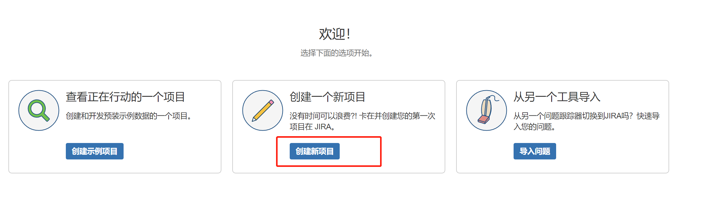

1.2 选择Scrum敏捷开发模式

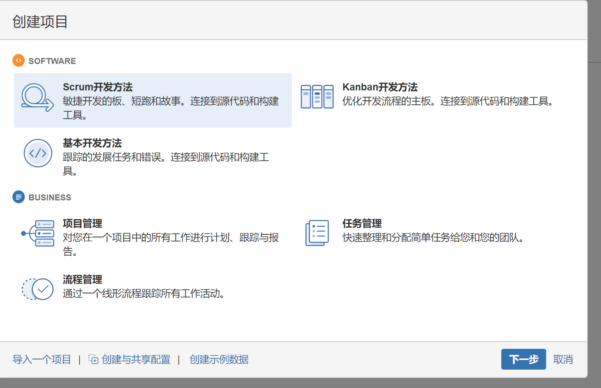

1.3 点击下一步

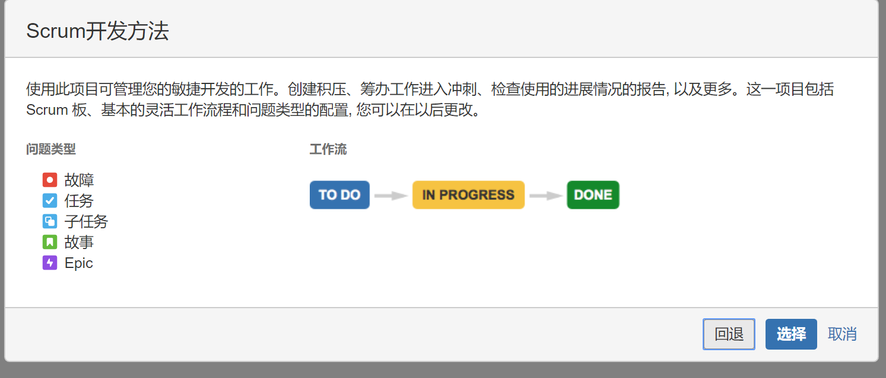

1.4 填写项目名,别名完成创建

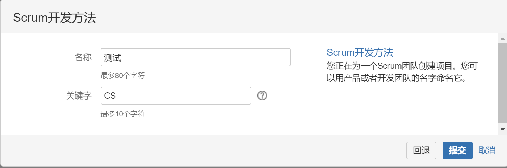

1.5 所有项目中可查看刚创建的项目

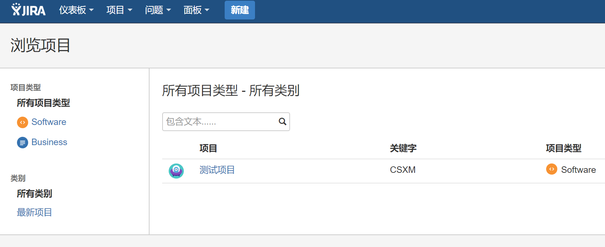

2、为项目创建一个1.0.0版本
2.1 按照图上操作添加版本

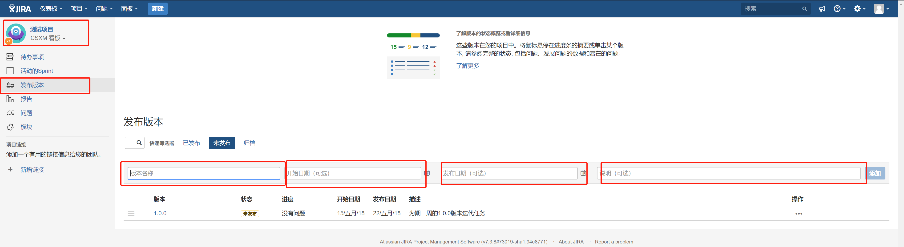

3、为1.0.0版本创建一个问题
3.1 点击新建创建问题 选择版本为刚创建的版本1.0.0

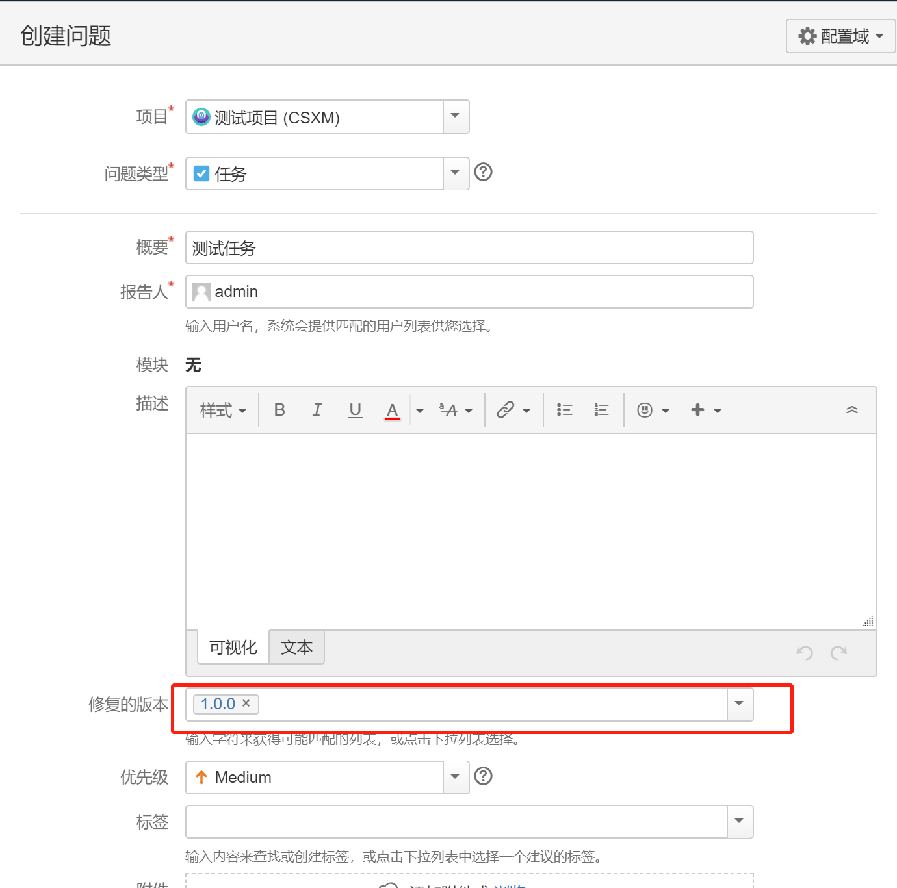

创建问题后可以在版本中查看

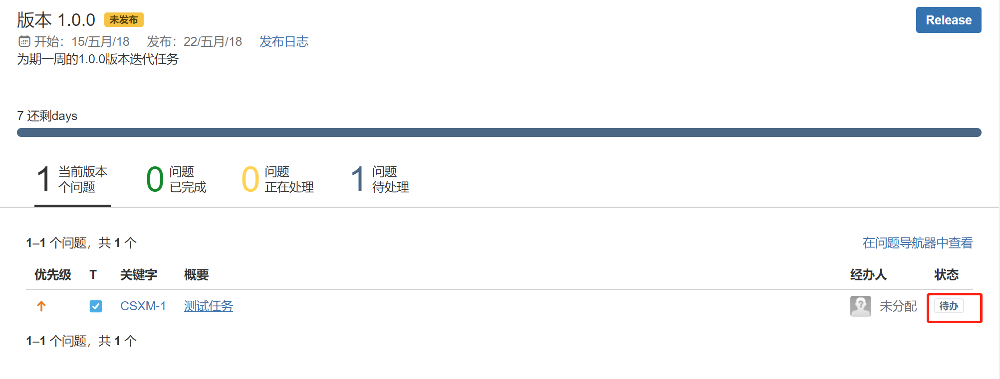

点击发布版本时会提醒还有问题状态存在未解决需要先解决

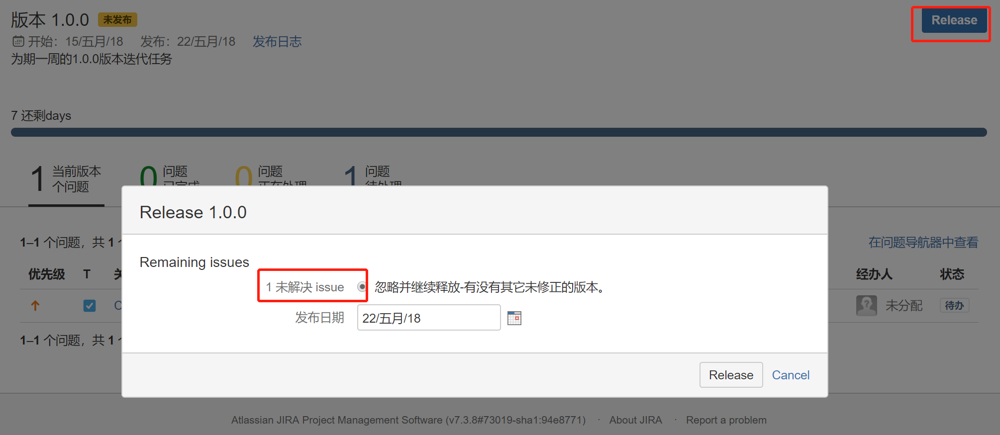

进入问题详情 完成任务后,返回版本查看当前版本问题已全部解决,即可发布

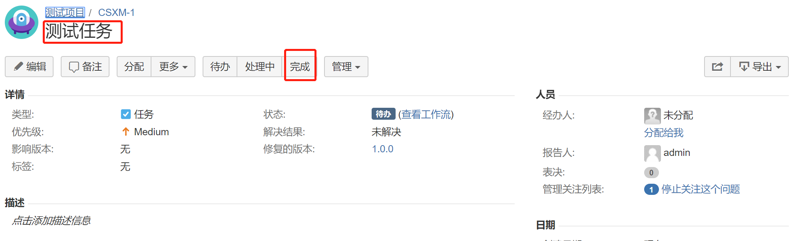
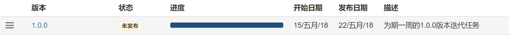
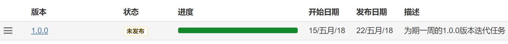
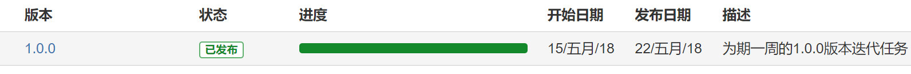