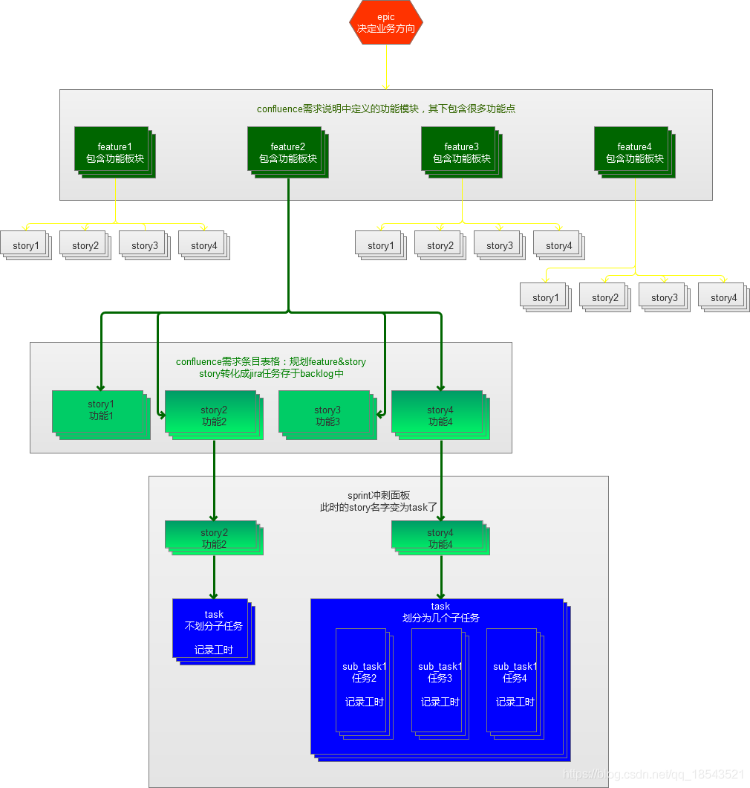
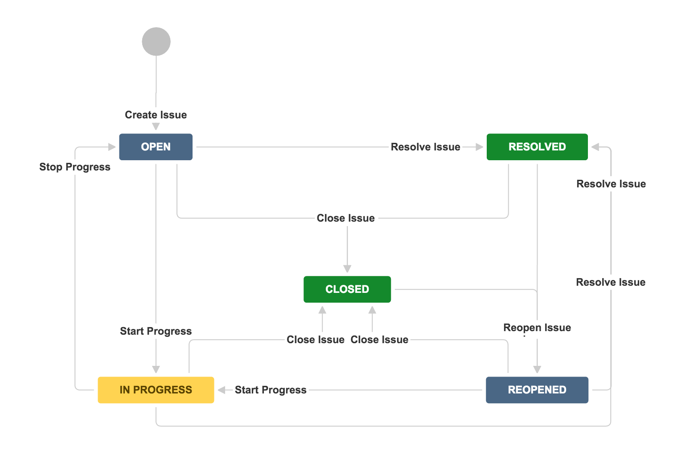

# Hierarchy In Jira Jira 里的层级关系

@Yuanwen LI
10/10 2020

在Jira里，一个project里存在如下几个层级关系：
* Epic 史诗
* feature/ New feature 特性/新特性
* Story 故事
* Task 任务
* Sub-Task 子任务
* Improvement 改进
* Bug 缺陷

其主体关系如下图：

 **Figure 1** - Hierarchy in Project
层级关系是联动的，如果子关系的状态发生改变，随之会引起上级关系状态的改变，比如当一个已关闭的任务里的子任务状态由完成变成进行中，那么该任务又将会被置于未完成状态，直到所有子任务完成。
## 一个story 需要填写的字段 Field
一般是名称、详细描述、提交人、提交时间、优先级、状态等等。这些属性就是Field字段。而所谓的Story，也是Type属性为“Story”的Issue而已，把Type属性改成“Epic”，那这个Story就会变成Epic了。

## Workflow和Workflow Scheme 工作流程
workflow scheme 里规定任务的不同状态
常见状态有：
待办，进行中，已完成
也可以是：
刚提交，待评审，暂缓，已拒绝，开发中，已完成，等等。

Workflow由两部分组成：
* Status 状态
* Transition 转换动作

一个典型的工作流如下图：

**Figure 2** - a classic workflow

每个Project只能采用一种Workflow Scheme